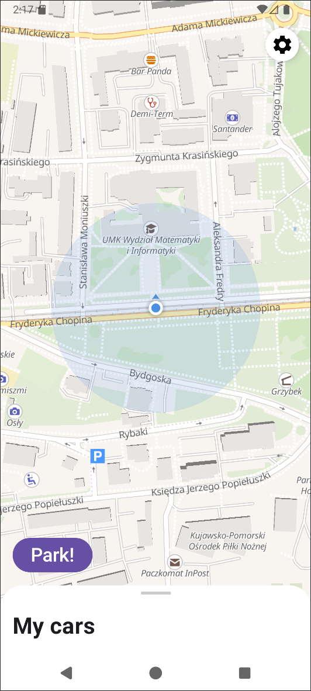

# Where's My Car

A **Kotlin Android app** to save and track the location of your parked cars.  
This is my **learning project**, currently **temporarily on hold** due to other projects and studies.

**Work in Progress**

### Current features
- Map showing your current location
- Basic UI

### Planned features
- Add multiple cars and display their last saved location on the map
- User accounts & login
- Sharing cars between users
- NFC sticker scan to "park" a car
- Push notifications
- External database integration (Firebase)

### Screenshot

